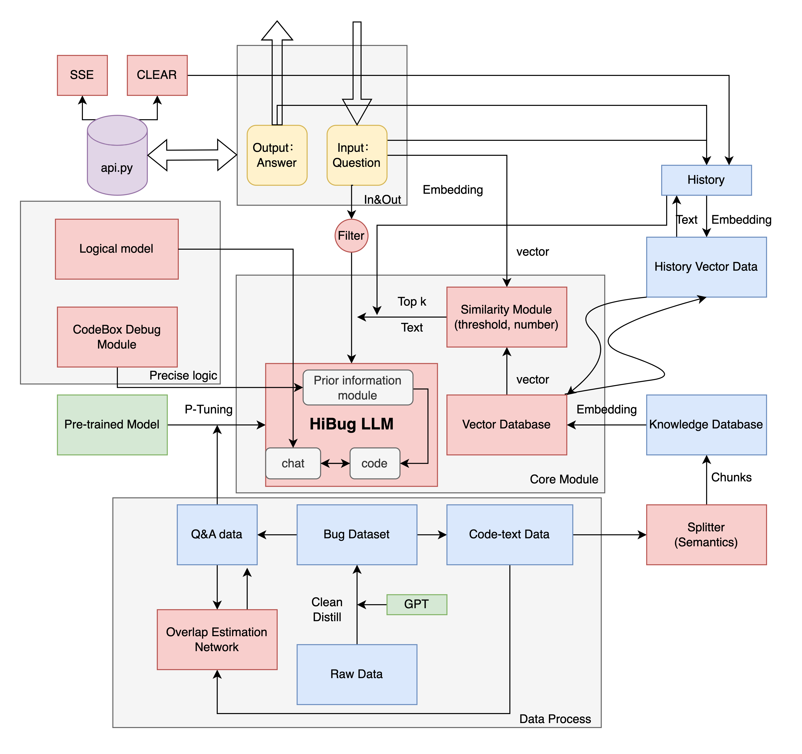
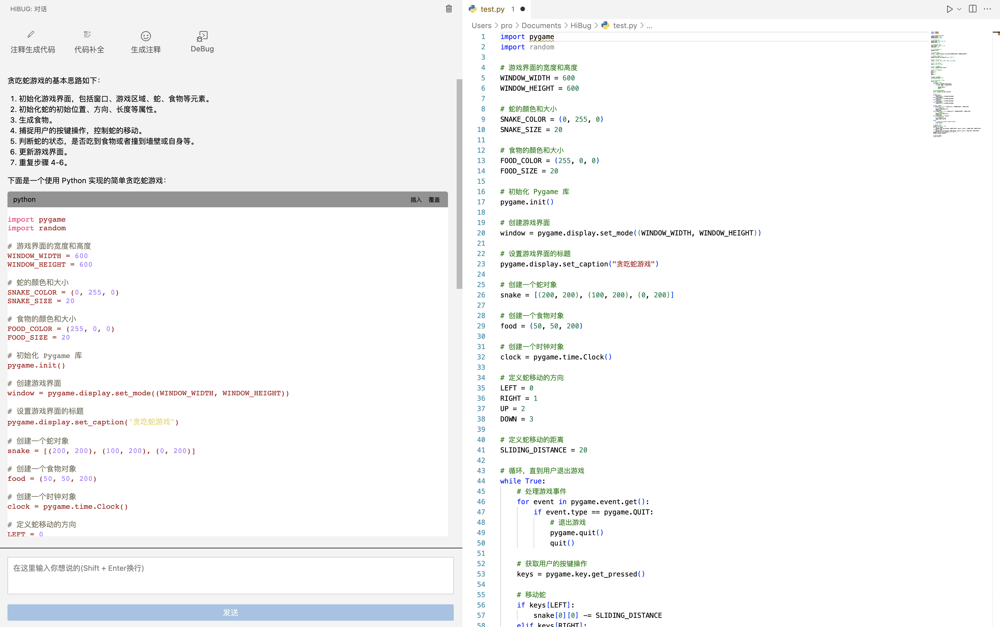
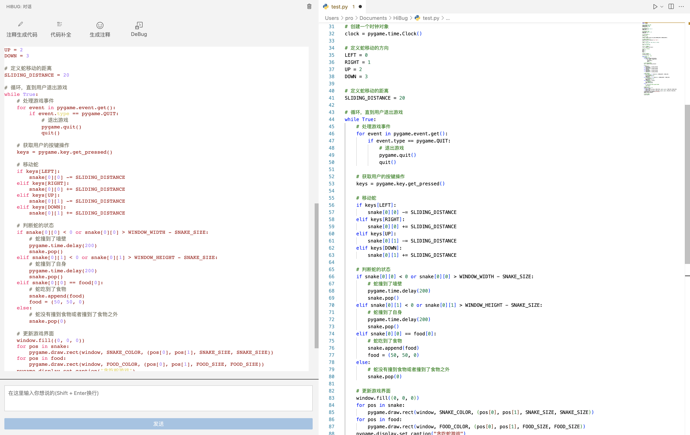

# HiBug-6B: A Powerful Assisting Coding LLM
## 1. introduction
HiBug-6B is the first-generation code model with 0.6 billion parameters, which shows excellent performance and robustness in many aspects. Our brief pipline framework is as follows.

HiBug-6B has surpassed CodeGeeX2-6B and the 15 billion parameter StarCoder-15B in the field of code generation, and retains powerful dialogue capabilities as well. In a nutshell, we finetune the pre-trained model with nearly 2TB of code data, and couple the local knowledge base, vector database, code logic module, and prior debug module to get a high-intensity model which especially focuses on code.More specifically:
### Powerful Code Capabilities: 
Based on the commercial open source language model, HiBug-6B is further pre-trained on 2TB of code data (~640 Billion tokens). Compared with the current mainstream open source models, HiBug-6B ranks first in the average of the five programming languages（Python, C++, Java, Javascript, Go） in the HumanEval-X dataset, beating CodeGeeX2-6B by 0.3% and StarCoder-15B by 10%. In terms of specific programming languages, HiBug-6B achieved a 35.7% Pass@1 one-time pass rate on C++ (21.8% higher than CodeGeeX2-6B).
### Comprehensive Code-task-driven: 
HiBug-6B covers nearly 100 programming languages and performs impressively in major languages. Moreover, the model adapts to a variety of code tasks, and has shown strong capabilities in code generation, code completion, code debug, code annotation, etc., which also benefits from a large amount of code data behind it. At the same time, we freeze and retain part of the neural network parameters of the original dialogue large model, which also makes HiBug-6B to have a very strong expression fluency while completing the code tasks.
### Excellent Migration: 
Since HiBug-6B uses many isolated detachable modules, including langchain linking database module, logic module, debug prior compilation module, etc., developers can design local knowledge base according to their own requirements, and replace modules as well. HiBug-6B can be designed as an interactive AI programming assistant (especially good at it), supporting both English and Chinese conversations to solve various programming problems, as well as simple question-and-answer conversations.
### Fast Inference: 
Based on Multi-Query Attention and Flash Attention technologies, HiBug-6B has very efficient inference speed and lower GPU memory. At the same time, HiBug-6B supports streaming output, providing a more refined user experience.
## 2. Update information
[2023/08/10] Release of HiBug-6B large model. HiBug-6B incorporates multi-dimensional techniques, supports multi-round conversational reasoning for long text, and focuses on code capabilities.
## 3. Get Model Parameters
We also offer full-parameter fine-tuning and ptuningv2 fine-tuning. It should be noted that due to the sensitivity of the model, the open source code does not contain the model parameters and finetune program. Please contact contact@hibug.com for further information about the model parameters and finetune program. We also have HiBug-13B for business private deployment, HiBug-30B in testing. Please visit www.hibug.com for more information, and if you are interested in business cooperation, send us an email with details at contact@hibug.com.
## 4. Statement
HiBug-6B open source model aims to promote the development of large model technology together with the open source community, and urges developers and everyone to abide by the open source protocol. In addition, developers should not use open source models and code and derivatives based on open source projects for any purpose that may cause harm to the country and society, and for any services that have not been evaluated and documented for safety. The project does not assume the risk of data security and public opinion caused by the open source model and code, or the risk and liability arising from the misdirection, abuse, dissemination, and improper use of any model.
## 5. Display


## 6. QuickStart
1. git clone our repository
```
git clone https://github.com/HiBugEnterprise/HiBug-6B.git
```
2. Install the graphics driver and corresponding cuda. CUDA>=11.6.
3. Create a virtual environment and activate:
```
conda create --name hibug python=3.10
```
```
conda activate hibug
```
4. Install dependency packages：
```
pip install -r requirements.txt
```
5. When running multiple Gpus, consider installing accelerate：
```
pip install accelerate
```
6. Place the applied model parameter file (~ 15G) in the hibugmodel folder and hibugcodemodel folder respectively according to the email instructions
7. Start start api program：
```
python api.py
```
Note that the hardware requirements of our model are about 15G GPU video memory (single card or multi-card distribution), which can support unlimited rounds of conversation recording due to the integration of history's vector database storage, and the video memory is stable at about 15G. We do not provide quantified versions at this time. And we load the model in two batches which including code and chat(two folders).
## 7.Evaluation Result
We evaluate dialog and code capabilities on HumanEval, MBPP, HumanEval-X benchmarks. Due to space reasons, please refer to future papers for more Pass@10,100 test results.
### Dialogue Ability: chat-C-Eval Chinese Dataset

|Model|	Average|	STEM	|Social Sciences|	Humanities|
|  ----  | ----  |  ----  | ----  |  ----  |
|ChatGLM-6B|	41.0|	33.3|	48.3|	41.3|
|ChatGLM2-6B|	52.5|	46.4|	60.4|	50.6|
|**HiBug-6B**|	**54.9**|	**48.2**|  **62.3**|	**54.1**|

### Code Ability: HumanEval & MBPP (Pass@1)

|Model|	HumanEval| 	MBPP|
|  ----  | ----  |  ----  |
|LaMDA-137B|	21.7|	30.2|
|LLaMA-6B|	15.8|	22.0|
|CodeGen-16B-multi|	18.3|	20.9|
|LLaMA-33B|	21.7|	30.2|
|CodeGeeX|	22.9|	24.4|
|LLaMA-65B|	23.7|	37.7|
|PaLM-540B|	26.2|	36.8|
|Codex-12B|	28.8|	—|
|CodeGen-16B-Mono|	29.3|	35.3|
|LLaMA2-70B|	29.9|	—|
|StarCoderBase|	30.4|	49.0|
|CodeT5Plus-16B-mono|	30.9|	—|
|code-cushman-001|	33.5|	45.9|
|CodeGen2.5-7B-mono|	33.4|	—|
|StarCoder|	33.6|	52.7|
|CodeGeeX2-6B|	35.9|	—|
|StarCoder-Prompte|	40.8|	**49.5**|
|**HiBug-6B**|	**42.4**|	49.1|

### Code Ability: code-HumanEval-X (Pass@1)

|Model|	Python|	C++|	Java|	JavaScript|	Go|	Overall|
|  ----  | ----  |  ----  |  ----  | ----  |  ----  |  ----  |
|CodeGen-16B-multi|	19.2|	18.1|	15.0|	18.4|	13.0|	16.7|
|CodeGeeX-6B|	22.9|	17.1|	20.0|	17.6|	14.4|	18.4|
|Replit-code-v1-3B|	22.0|	20.1|	20.1|	20.1|	12.2|	18.9|
|CodeGen2.5-7B-multi|	30.6|	24.3|	29.0|	27.5|	18.9|	26.1|
|StarCoder-15B|	35.5|	28.2|	**31.5**|	**33.2**|	21.3|	29.9|
|CodeGeeX2-6B|	35.9|	29.3|	30.8|	32.2|	22.5|	30.1|
|**HiBug-6B**|	**36.9**|	**35.7**| 30.9| 22.3| **25.4**|	**30.2**| 


### Dataset: Highquality to be Fine-tuning
|Evaluation|ADGEN|	HiBug Code Dataset|
|  ----  |  ----  |  ----  |
|BLEU-4|	8.10|	51.82|
|Rouge-1|	31.12|	40.72|
|Rouge-2|	7.11|	20.19|
|Rouge-L|	24.97|	31.67|
|Training Loss|	3.74|	2.79|

## 8. Acknowledgement
Thanks to some projects in the open source community: including commercial open source model MPT Base, langchain-LLM project of chatchat-space, chinese-lert-large vector database, etc. References are noted in the code project.


